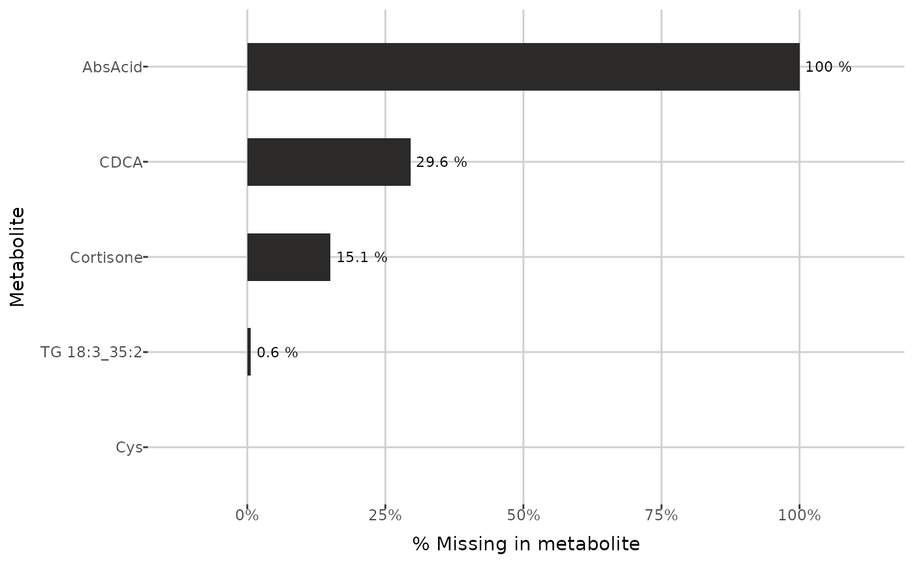
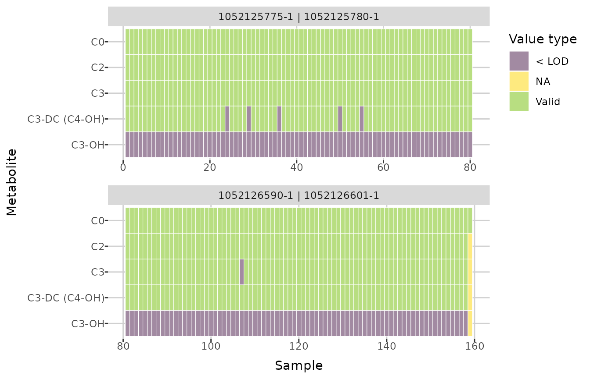
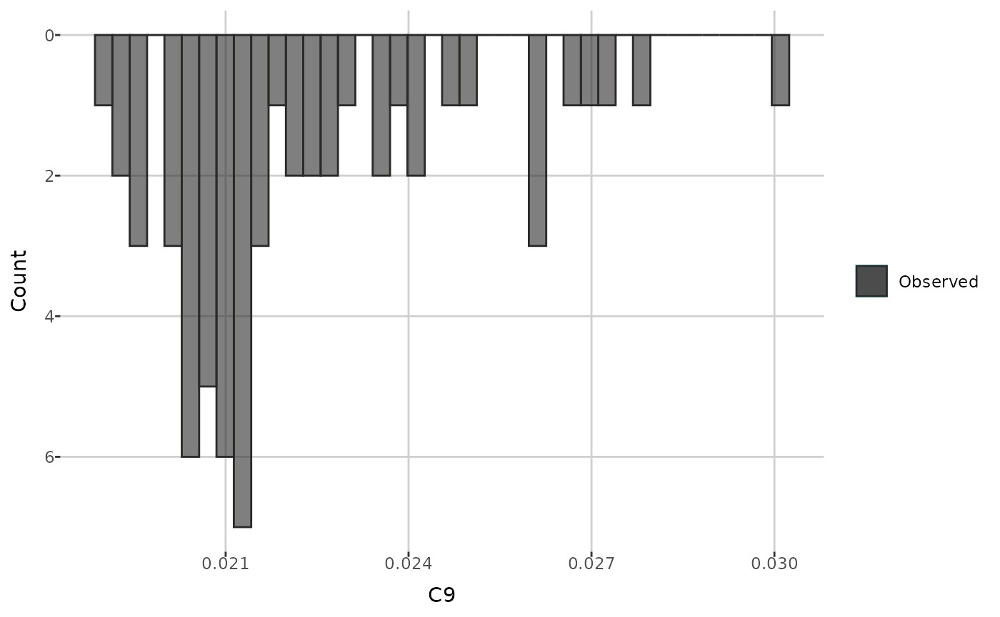
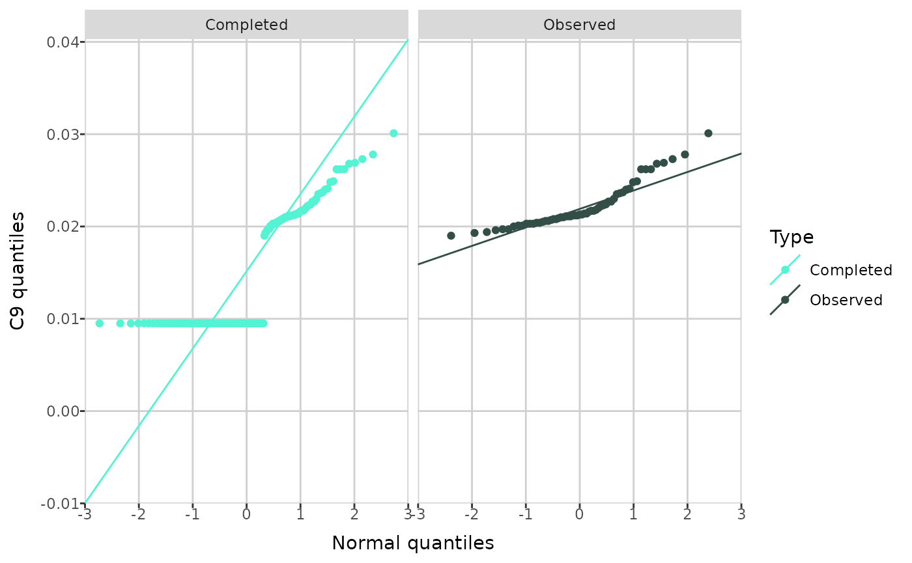

# A quick introduction to MetaboCrates

## Introduction

The *MetaboCrates* package provides tools for processing and analyzing
targeted metabolomics data (e.g., generated using Biocrates® kits). You
can easily upload data and perform automated preprocessing, such as data
cleaning and missing value imputation, followed by visualizations and
descriptive statistics for data exploration. The package also includes
tools for quality control and outlier detection.

## Getting started

*MetaboCrates* can be easily installed and loaded into the environment
using the following commands.

``` r
devtools::install_github("BioGenies/MetaboCrates")

library(MetaboCrates)
```

Next, metabolomics data can be imported with the
[`read_data()`](http://biogenies.info/MetaboCrates/reference/read_data.md)
function. In this guide, an example dataset included in the package will
be used.

``` r
path <- get_example_data("two_sets_example.xlsx")
dat <- read_data(path)

get_info(dat)
#> [1] "Data contains 13 sample types and 2 NA types."
```

The class of the `dat` object is both `data.frame` and `raw_data`. It
has the following attributes:

- `LOD_table` - table containing the limits of detection (LOD), lower
  limit of quantification (LLOQ), and upper limit of quantification
  (ULOQ).
- `NA_info`
  - `counts` - types of missing values found in the data with their
    counts,
  - `NA_ratios_type` - fractions of missing values of each type for
    every metabolite,
  - `NA_ratios_group` - fractions of missing values with respect to
    group levels for every metabolite,
- `metabolites` - names of metabolites in the data,
- `samples` - names of sample types with counts,
- `group` - names of grouping columns (appears after using the
  [`add_group()`](http://biogenies.info/MetaboCrates/reference/add_group.md)
  function),
- `removed` - names of metabolites removed based on the:
  - `LOD` - proportion of missing values,
  - `QC` - coefficient of variation (CV),
- `completed` - completed data (appears after imputation),
- `cv` - coefficients of variation based on QC sample type for each
  metabolite (appears after using the
  [`calculate_CV()`](http://biogenies.info/MetaboCrates/reference/calculate_CV.md)
  function).

Non-null attributes at this stage are shown below.

``` r
attr(dat, "LOD_table")[,1:5]
#>                    plate bar code     C0     C2     C3 C3-DC (C4-OH)
#> 1   LOD (calc.) 1052125775-1 [µM]     NA     NA     NA            NA
#> 2   LOD (calc.) 1052125780-1 [µM] 0.7702 0.0545 0.0000        0.0206
#> 3   LOD (calc.) 1052126590-1 [µM]     NA     NA     NA            NA
#> 4   LOD (calc.) 1052126601-1 [µM] 1.4720 0.0269 0.0000        0.0002
#> 5 LOD (from OP) 1052125775-1 [µM]     NA     NA     NA            NA
#> 6 LOD (from OP) 1052125780-1 [µM] 1.6670 0.1333 0.1222        0.0900
#> 7 LOD (from OP) 1052126590-1 [µM]     NA     NA     NA            NA
#> 8 LOD (from OP) 1052126601-1 [µM] 1.6670 0.1333 0.1222        0.0900

attr(dat, "NA_info")[["NA_ratios"]][5:10,]
#> NULL
attr(dat, "NA_info")[["counts"]]
#> # A tibble: 2 × 2
#>   type      n
#>   <chr> <dbl>
#> 1 < LOD 16240
#> 2 NA      316

attr(dat, "metabolites")[1:10]
#>  [1] "C0"            "C2"            "C3"            "C3-DC (C4-OH)"
#>  [5] "C3-OH"         "C3:1"          "C4"            "C4:1"         
#>  [9] "C5"            "C5-DC (C6-OH)"

attr(dat, "samples")[1:5,]
#> # A tibble: 5 × 2
#>   `sample type` count
#>   <chr>         <int>
#> 1 Blank             1
#> 2 QC Level 1        2
#> 3 QC Level 2        6
#> 4 QC Level 3        2
#> 5 Sample          159
```

Now, information about missing values can be displayed.

``` r
attr(dat, "NA_info")[["counts"]]
#> # A tibble: 2 × 2
#>   type      n
#>   <chr> <dbl>
#> 1 < LOD 16240
#> 2 NA      316

plot_mv_types(dat)
```


## Group selection

Using the
[`add_group()`](http://biogenies.info/MetaboCrates/reference/add_group.md)
function, you can specify columns (which must not contain any missing
values) to group the data by. Although this step is optional, some
functions require grouped data.

``` r
grouped_dat <- add_group(dat, c("submission name", "species"))
```

After grouping,the `NA_info` attribute contains the proportion of
missing values in group levels for each metabolite. Moreover, the
grouping columns names are added to the `group` attribute.

``` r
attr(grouped_dat, "NA_info")[["NA_ratios_group"]][5:10,]
#> # A tibble: 6 × 3
#>   metabolite grouping_column         NA_frac
#>   <chr>      <chr>                     <dbl>
#> 1 3-IPA      2023LS_s2, human          0    
#> 2 3-IPA      2023_Lukasz_S_s1, human   0    
#> 3 3-Met-His  2023LS_s2, human          0    
#> 4 3-Met-His  2023_Lukasz_S_s1, human   0    
#> 5 5-AVA      2023LS_s2, human          0.114
#> 6 5-AVA      2023_Lukasz_S_s1, human   0.238

attr(grouped_dat, "group")
#> [1] "submission name" "species"
```

Below, the information about grouped data are displayed.

``` r
cat(get_info(grouped_dat))
#> Data contains 13 sample types and 2 NA types.
#> Groupping by: "submission name" (4 levels). Data contains 13 sample types and 2 NA types.
#> Groupping by: "species" (4 levels).

plot_groups(grouped_dat)
```


## Compounds filtering

To investigate the missing values ratios in each metabolite, the
[`plot_NA_percent()`](http://biogenies.info/MetaboCrates/reference/plot_NA_percent.md)
function can be used.

``` r
example_metabolites <- c("Cys", "TG 18:3_35:2", "Cortisone", "CDCA", "AbsAcid")

plot_NA_percent(grouped_dat, type = "joint", interactive = FALSE) +
  ylim(example_metabolites)
```



``` r

plot_NA_percent(grouped_dat, type = "NA_type", interactive = FALSE) +
  ylim(example_metabolites)
```


``` r

plot_NA_percent(grouped_dat, type = "group", interactive = FALSE) +
  ylim(example_metabolites)
```


When not grouped data passed, function below returns the names of
metabolites which have more than the given threshold of missing values.
If the grouping is specified, then it returns only metabolites for which
the threshold is exceeded in each group level. In the examples below the
threshold is 20%.

``` r
get_LOD_to_remove(dat, 0.2)[1:5]
#> [1] "AbsAcid"  "Ac-Orn"   "Anserine" "BABA"     "C10:1"

get_LOD_to_remove(grouped_dat, 0.2)[1:5]
#> [1] "AbsAcid"  "Ac-Orn"   "Anserine" "C10:1"    "C10:2"
```

If the grouping with up to 4 levels is specified, then the Venn diagram
can be created, which shows the counts of metabolites having ratios of
missing values larger than the given threshold for each group level.

``` r
create_venn_diagram(grouped_dat, 0.2)
```


Finally, we can remove the chosen metabolites using the
[`remove_metabolites()`](http://biogenies.info/MetaboCrates/reference/remove_metabolites.md)
function with `type` specified as `LOD`. Instead of actually removing
them from data, this function adds provided metabolites to the `removed`
attribute.

``` r
rm_dat <- remove_metabolites(grouped_dat,
                             metabolites_to_remove = c("AbsAcid", "Ac-Orn"),
                             type = "LOD")

attr(rm_dat, "removed")
#> $LOD
#> [1] "AbsAcid" "Ac-Orn" 
#> 
#> $QC
#> NULL
```

Then, the data and missing values ratios without removed metabolites can
be displayed. Below, the first 5 rows of both tibbles and chosen columns
of the first are visible.

``` r
show_data(rm_dat)[1:5, c(1:3, 19:21)]
#>                plate bar code sample bar code sample type    C2     C3
#> 1 1052126590-1 | 1052126601-1        10000001       Blank    NA     NA
#> 2 1052125775-1 | 1052125780-1      1020527268  QC Level 1 1.999 0.7022
#> 3 1052126590-1 | 1052126601-1      1020527268  QC Level 1 2.083 0.7166
#> 4 1052125775-1 | 1052125780-1      1020527272  QC Level 2 3.689  1.461
#> 5 1052125775-1 | 1052125780-1      1020527272  QC Level 2 3.088  1.369
#>   C3-DC (C4-OH)
#> 1            NA
#> 2         < LOD
#> 3        0.0134
#> 4        0.0346
#> 5        0.0344

show_ratios(rm_dat)[1:5,]
#> # A tibble: 5 × 2
#>   metabolite NA_frac
#>   <chr>        <dbl>
#> 1 1-Met-His    0    
#> 2 3-IAA        0    
#> 3 3-IPA        0    
#> 4 3-Met-His    0    
#> 5 5-AVA        0.176
```

There are two options for restoring metabolites - either specific ones
can be selected or all metabolites from the specified type can be
restored.

``` r
attr(unremove_metabolites(rm_dat, "AbsAcid"), "removed")
#> $LOD
#> [1] "Ac-Orn"
#> 
#> $QC
#> NULL

attr(unremove_all(rm_dat, "LOD"), "removed")
#> $LOD
#> NULL
#> 
#> $QC
#> NULL
```

## Gaps completing

Aside from removing metabolites, missing values can be also imputed
using the
[`complete_data()`](http://biogenies.info/MetaboCrates/reference/complete_data.md)
function. It completes missing values related to the limits of
quantification and detection. Imputation of values below the limit of
detection (`< LOD`) can be performed in one of seven ways:

- `NULL` - skipping imputation,
- `halfmin` - half of the minimum observed value,
- `halflimit` - half of the detection limit,
- `random` - random number not smaller than the limit of detection and
  not bigger than the minimum observed value,
- `limit` - the detection limit,
- `limit-0.2min` - the detection limit minus 0.2 times the minimum
  observed value,
- `logspline` - random number from a logspline density fitted to the
  observed values.

Values below the quantification limit (`< LLOQ`) can be imputed using
either `NULL` or `limit` methods. Similarly, values above the upper
limit of quantification (`> ULOQ`) can be imputed using the `NULL` and
`limit` methods or

- `third quartile` - third quartile of the observed values,
- `scaled random` - random number higher than the upper limit of
  quantification but lower than its double.

Completed dataset is then stored as the `completed` attribute.

``` r
comp_dat <- complete_data(rm_dat,
                          LOD_method = "halfmin",
                          LLOQ_method = "limit",
                          ULOQ_method = "third quartile")
```

To investigate missing values, you can use the
[`plot_heatmap()`](http://biogenies.info/MetaboCrates/reference/plot_heatmap.md)
function, which creates a heatmap indicating whether a value is missing
for each sample and metabolite, depending on the plate bar code. You can
specify a plate bar code to generate a single plot; otherwise, if there
are multiple plate bar codes in the dataset, a faceted plot will be
created. If `show_colors = TRUE`, each missing value type is shown in a
different color. Below, cropped plots are presented, showing the first
five metabolites.

``` r
plot_heatmap(comp_dat, plate_bar_code = "1052125775-1 | 1052125780-1") +
   ylim(attr(comp_dat, "metabolites")[5:1])
```


``` r

plot_heatmap(comp_dat) +
   ylim(attr(comp_dat, "metabolites")[5:1])
```



Next, you can compare the distributions of an individual metabolite
before and after imputation. The
[`create_distribution_plot()`](http://biogenies.info/MetaboCrates/reference/create_distribution_plot.md)
function can generate a histogram, density plot, and beeswarm plot
(either regular or interactive with tooltips). Additionally, for
histogram, you can choose to display either all values after imputation
or only those that were previously missing and then imputed.

``` r
create_distribution_plot(comp_dat, metabolite = "C9", bins = 40)
```


``` r

create_distribution_plot(comp_dat, metabolite = "C9", bins = 40,
                         histogram_type = "imputed")
```



``` r

create_distribution_plot(comp_dat, metabolite = "C9", type = "density")
```


``` r

create_distribution_plot(comp_dat, metabolite = "C9",
                         type = "beeswarm")
```


*MetaboCrates* also offers two types of Q-Q plots: a theoretical Q-Q
plot (using the
[`create_qqplot()`](http://biogenies.info/MetaboCrates/reference/create_qqplot.md)
function), which compares the quantiles of a metabolite with the
quantiles of the normal distribution, and an empirical Q-Q plot (with
[`create_empirical_qqplot()`](http://biogenies.info/MetaboCrates/reference/create_empirical_qqplot.md)),
which compares the quantiles of metabolite values before and after
imputation.

``` r
create_qqplot(comp_dat, metabolite = "C9")
```



``` r

create_empirical_qqplot(comp_dat, metabolite = "C9")
```


After imputation, you can perform quality control and outlier detection.

## Quality control

To perform quality control, you must calculate the coefficients of
variation (CV) for each quality control type using the completed data.

``` r
qc_dat <- calculate_CV(comp_dat)
```

The coefficients of variation can now be accessed in the `cv` attribute.

``` r
attr(qc_dat, "cv")[1:5,]
#> # A tibble: 5 × 3
#>   `sample type` metabolite      CV
#>   <chr>         <chr>        <dbl>
#> 1 QC Level 1    1-Met-His  0.0392 
#> 2 QC Level 1    3-IAA      0.00646
#> 3 QC Level 1    3-IPA      0.0252 
#> 4 QC Level 1    3-Met-His  0.0322 
#> 5 QC Level 1    5-AVA      0.0722
```

You can obtain the metabolites with CV values greater than a specified
threshold using the following function.

``` r
get_CV_to_remove(qc_dat, 0.8)[1:5]
#> [1] "C14:1"          "C3-DC (C4-OH)"  "Cer d18:1/26:0" "Cer d18:2/18:0"
#> [5] "DG 14:1_18:1"
```

To remove metabolites from the data, use the
[`remove_metabolites()`](http://biogenies.info/MetaboCrates/reference/remove_metabolites.md)
function.

``` r
qc_dat <- remove_metabolites(qc_dat, c("C14:1", "C3-DC (C4-OH)"), "QC")

attr(qc_dat, "removed")
#> $LOD
#> [1] "AbsAcid" "Ac-Orn" 
#> 
#> $QC
#> [1] "C14:1"         "C3-DC (C4-OH)"
```

## Outlier detection

To detect outliers and patterns corresponding to variation in the data,
you can use principal component analysis (PCA). *MetaboCrates* offers
several PCA plots. The function below creates PCA scatterplots, which
visualize the clustering of observations with respect to the sample type
or group level.

``` r
create_PCA_plot(qc_dat,
                types_to_display = c("Sample", "QC Level 1", "QC Level 2"))
```

``` r

create_PCA_plot(qc_dat, group_by = "group")
```

Using the same function, you can also generate biplots (based on data
with all sample types if `group_by = "sample_type"`, or only type
*Sample* when `group_by = "group"`), displaying loadings above a given
threshold. This plot type illustrates how each metabolite contributes to
the first two principal components and highlights metabolites that
capture similar information.

``` r
create_PCA_plot(qc_dat, type = "biplot", threshold = 0.05, interactive = FALSE)
```


``` r

create_PCA_plot(qc_dat, type = "biplot", group_by = "group", threshold = 0.05,
                interactive = FALSE)
```


Finally, you can investigate the percentage of total variance in the
data explained by each principal component. Additionally, cumulative
variance - the sum of the percentage variance contributions from the
first principal component up to a given component - can be displayed.
Threshold determines which principal components are shown: all
components for which the cumulative variance remains below the threshold
are included, along with one additional component that brings the
cumulative variance just above the threshold (if applicable). You can
also specify the maximum number of principal components to display on
the plot.

``` r
pca_variance(qc_dat, threshold = 0.7)
```


``` r

pca_variance(qc_dat, threshold = 0.7, group_by = "group", max_num = 6,
             cumulative = FALSE)
```


